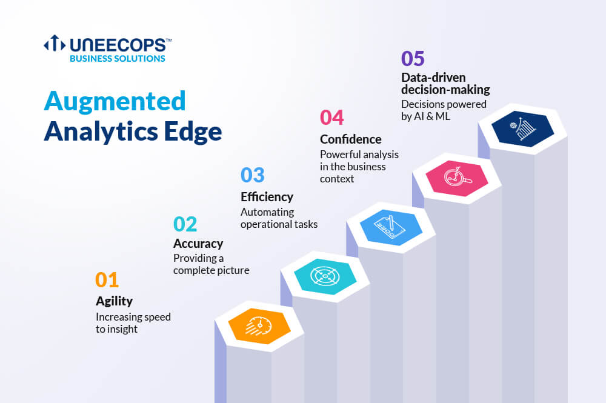

# Commerical_Website
Commercial Webiste
[index.html](https://github.com/user-attachments/files/24979471/index.html)
<!DOCTYPE html>
<html lang="en">
<head>
  <meta charset="UTF-8" />
  <meta name="viewport" content="width=device-width, initial-scale=1.0" />
  <title>Smart IT Sector gen 🚀</title>
  <link rel="stylesheet" href="style.css" />
  <link rel="stylesheet" href="https://cdnjs.cloudflare.com/ajax/libs/font-awesome/6.5.0/css/all.min.css">
</head>
<body>

  <!-- HEADER -->
  <header>
    <h1 class="logo">💡Generation Technology</h1>
    <nav>
      <a href="#home">Home</a>
      <a href="#services">Services</a>
      <a href="#about">About</a>
      <a href="#portfolio">Portfolio</a>
      <a href="#contact">Contact</a>
    </nav>
  </header>

  <!-- HERO WITH SLIDER -->
  <section id="home" class="hero">
    

      <video autoplay muted loop playsinline>
          <source src="animation.mp4"  type="video/mp4">
    

    

      <h2>Innovating the Future with Technology 🌐</h2>
      
We build digital solutions that grow your business

      <button onclick="ctaClick()">Get Started</button>
    

  </section>

  <!-- SERVICES -->
  <section id="services" class="services">
    <h2>🚀 Our Services</h2>
    

      

        <i class="fa fa-code"></i>
        <h3>Web Development</h3>
        
Modern, responsive, and fast websites for your business.

        <button onclick="learnMore('Web Development')">Learn More</button>
      

      

        <i class="fa fa-mobile-screen-button"></i>
        <h3>App Development</h3>
        
Android & iOS apps built with cutting-edge tech.

        <button onclick="learnMore('App Development')">Learn More</button>
      

      

        <i class="fa fa-cloud"></i>
        <h3>Cloud Solutions</h3>
        
Secure and scalable cloud infrastructure services.

        <button onclick="learnMore('Cloud Solutions')">Learn More</button>
      

    

  </section>

  <!-- PORTFOLIO -->
  <section id="portfolio" class="portfolio">
    <h2>💼 Our Projects</h2>
    

      

        
        <a href="#">E-Commerce Platform</a>
      

      

        
        <a href="#">Corporate Website</a>
      

      

        
        <a href="#">Analytics Dashboard</a>
      

    

  </section>

  <!-- ABOUT -->
  <section id="about" class="about">
    <h2>👨‍💻 Meet Our Team</h2>
    

      
<i class="fa fa-user-gear"></i>
Expert Engineers

      
<i class="fa fa-lightbulb"></i>
Creative Thinkers

      
<i class="fa fa-shield-halved"></i>
Security Focused

    

  </section>

  <!-- CONTACT -->
  <section id="contact" class="contact">
    <h2>📩 Contact Us</h2>
    <form id="contactForm">
      <input type="text" id="name" placeholder="Your Name">
      <input type="email" id="email" placeholder="Your Email">
      <textarea id="message" placeholder="Your Message"></textarea>
      <button type="submit">Send Message</button>
    </form>

    

      
<i class="fa fa-phone"></i> +91 70171 64192

      
<i class="fa fa-envelope"></i> vidhansaxena9@gmail.com

      
<i class="fa fa-location-dot"></i> Pilibhit, India

    

  </section>

  <!-- FOOTER -->
  <footer>
    
© 2026 NextGen Tech Solutions | All Rights Reserved

    

      <i class="fab fa-facebook"></i>
      <i class="fab fa-linkedin"></i>
      <i class="fab fa-twitter"></i>
    

  </footer>

  
</body>
</html>

[style.css](https://github.com/user-attachments/files/24979472/style.css)
* {
  margin: 0;
  padding: 0;
  box-sizing: border-box;
  font-family: 'Segoe UI', sans-serif;
  scroll-behavior: smooth;
}

body {
  background: linear-gradient(135deg, #667eea, #764ba2);
  color: #333;
}

/* Header */
header {
  display: flex;
  justify-content: space-between;
  align-items: center;
  padding: 15px 40px;
  background: linear-gradient(90deg, #00c6ff, #0072ff);
  color: white;
  position: sticky;
  top: 0;
  z-index: 1000;
}

nav a {
  margin: 0 15px;
  color: white;
  text-decoration: none;
  font-weight: bold;
}

nav a:hover {
  color: yellow;
}

/* Hero */
.hero {
  position: relative;
  text-align: center;
  color: white;
}

.slider {
  height: 70vh;
  overflow: hidden;
  position: relative;
}

.slide {
  width: 100%;
  height: 70vh;
  object-fit: cover;
  position: absolute;
  opacity: 0;
  transition: opacity 1s ease-in-out;
}

.slide.active {
  opacity: 1;
}

.hero-text {
  position: absolute;
  top: 50%;
  left: 50%;
  transform: translate(-50%, -50%);
  background: rgba(0,0,0,0.5);
  padding: 30px;
  border-radius: 10px;
}

.hero button {
  margin-top: 15px;
  padding: 10px 20px;
  background: #ff9800;
  border: none;
  color: white;
  border-radius: 5px;
  cursor: pointer;
}

/* Services */
.services {
  padding: 60px 20px;
  text-align: center;
}

.service-grid {
  display: grid;
  grid-template-columns: repeat(auto-fit, minmax(250px, 1fr));
  gap: 20px;
  margin-top: 30px;
}

.service {
  background: white;
  padding: 20px;
  border-radius: 10px;
  box-shadow: 0 5px 15px rgba(0,0,0,0.2);
  transition: transform 0.3s;
}

.service:hover {
  transform: translateY(-10px);
}

.service i {
  font-size: 40px;
  color: #0072ff;
  margin-bottom: 10px;
}

/* Portfolio */
.portfolio {
  padding: 60px 20px;
  text-align: center;
  background: linear-gradient(135deg, #43cea2, #185a9d);
  color: white;
}

.portfolio-grid {
  display: grid;
  grid-template-columns: repeat(auto-fit, minmax(250px, 1fr));
  gap: 20px;
  margin-top: 30px;
}

.project img {
  width: 100%;
  border-radius: 10px;
}

.project a {
  display: block;
  margin-top: 10px;
  color: yellow;
  font-weight: bold;
}

/* About */
.about {
  padding: 60px 20px;
  text-align: center;
}

.team {
  display: flex;
  justify-content: center;
  gap: 40px;
  margin-top: 30px;
  flex-wrap: wrap;
}

.team div {
  font-size: 20px;
}

/* Contact */
.contact {
  padding: 60px 20px;
  text-align: center;
}

form {
  max-width: 400px;
  margin: auto;
  display: flex;
  flex-direction: column;
}

form input, form textarea {
  margin: 10px 0;
  padding: 10px;
  border-radius: 5px;
  border: 1px solid #ccc;
}

form button {
  background: #0072ff;
  color: white;
  padding: 10px;
  border: none;
  border-radius: 5px;
}

/* Footer */
footer {
  background: #222;
  color: white;
  text-align: center;
  padding: 20px;
}

.socials i {
  margin: 10px;
  cursor: pointer;
}

/* Responsive */
@media(max-width:768px){
  header {
    flex-direction: column;
  }
}

[script.js](https://github.com/user-attachments/files/24979474/script.js)// HERO SLIDER
let slides = document.querySelectorAll(".slide");
let index = 0;

function showSlide() {
  slides.forEach(slide => slide.classList.remove("active"));
  index = (index + 1) % slides.length;
  slides[index].classList.add("active");
}
setInterval(showSlide, 3000);

// CTA BUTTON
function ctaClick() {
  alert("🚀 Let's build something amazing together!");
  document.querySelector("#services").scrollIntoView({ behavior: "smooth" });
}

// LEARN MORE BUTTON
function learnMore(service) {
  alert("More details about " + service + " coming soon!");
}

// FORM VALIDATION
document.getElementById("contactForm").addEventListener("submit", function(e) {
  e.preventDefault();
  let name = document.getElementById("name").value.trim();
  let email = document.getElementById("email").value.trim();
  let message = document.getElementById("message").value.trim();

  if (name === "" || email === "" || message === "") {
    alert("⚠️ Please fill all fields!");
  } else {
    alert("✅ Message sent successfully!");
    this.reset();
  }
});

https://github.com/user-attachments/assets/0d6807f4-8527-42af-9994-40d686240276

